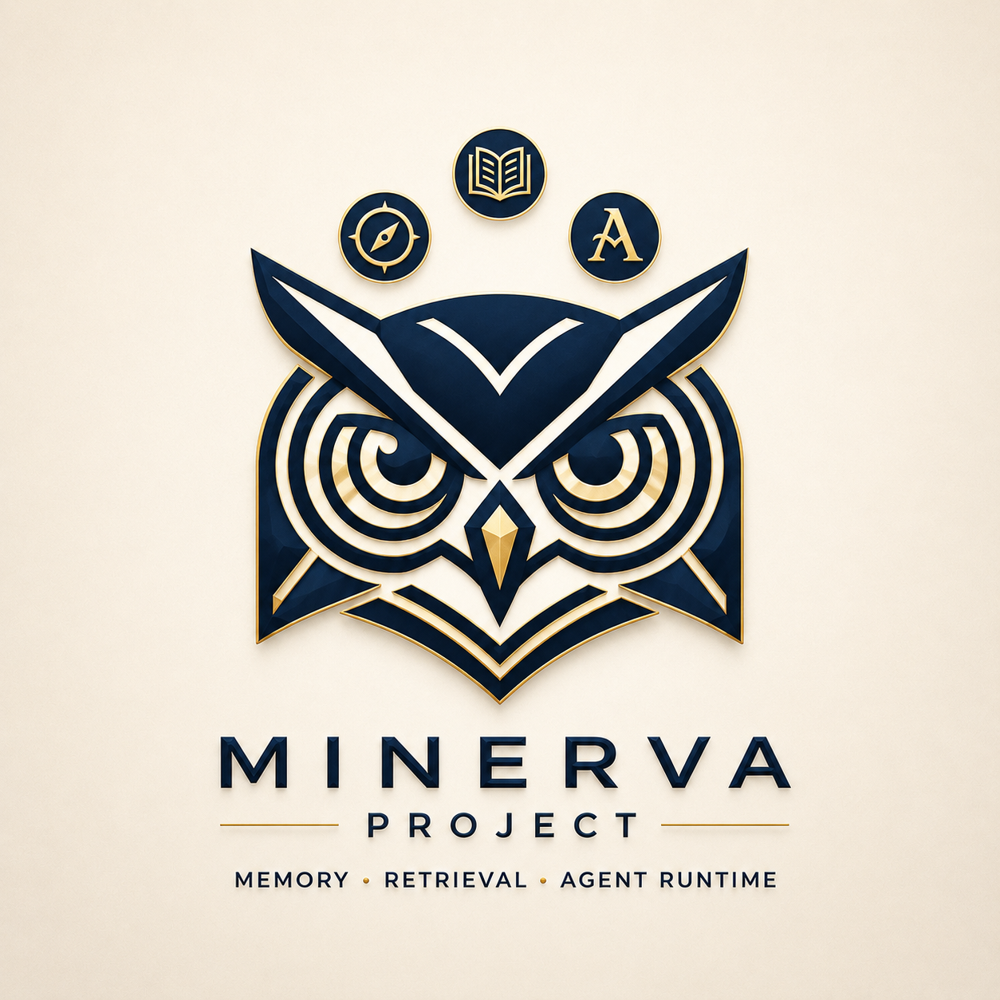
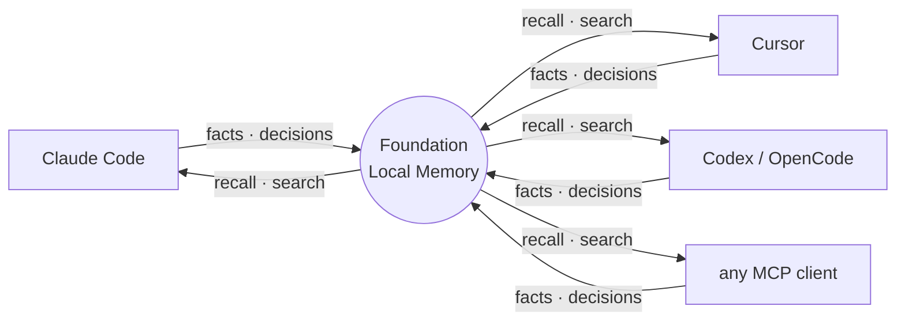
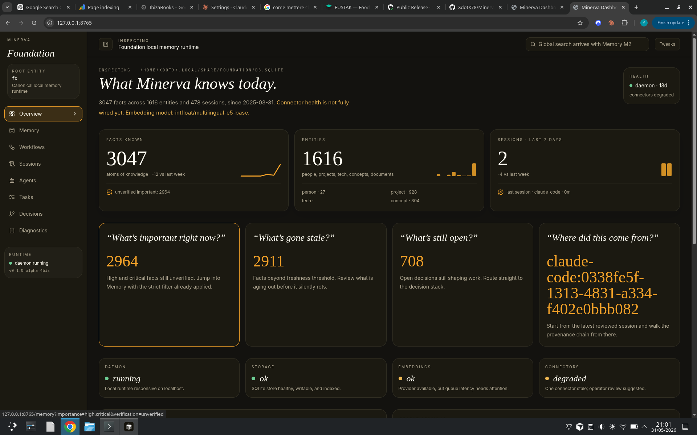
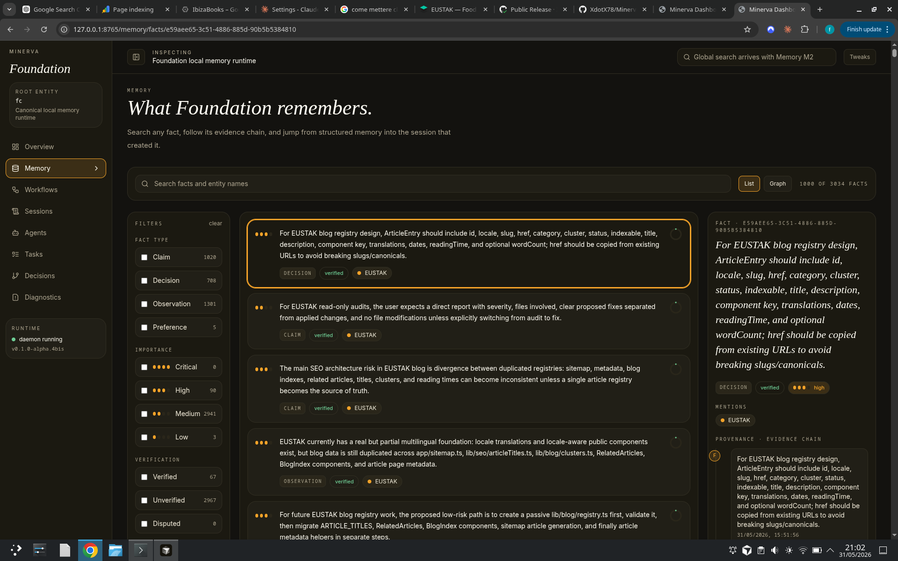
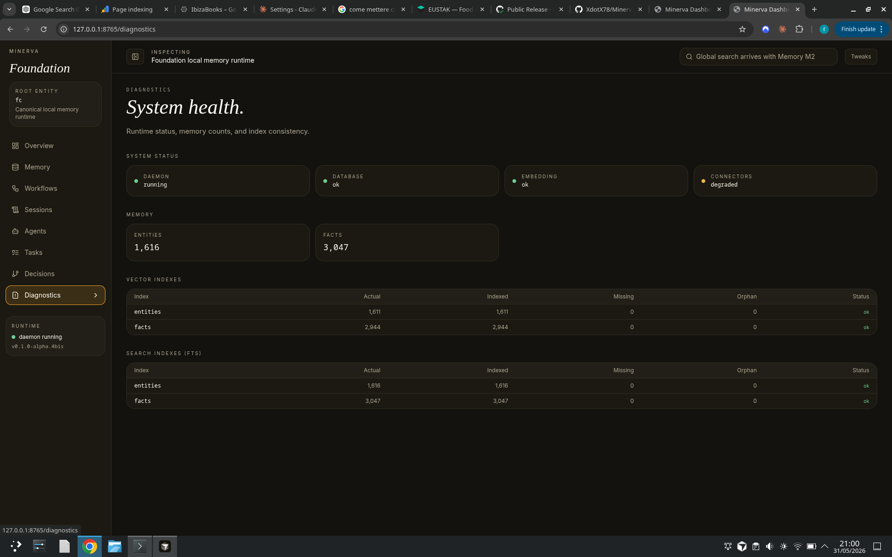

# Minerva

<p align="center">
  
</p>

<p align="center">
  
  
  
  
  
</p>

<p align="center">
  <a href="#install">Install</a> ·
  <a href="#connect-a-client">Connect</a> ·
  <a href="#minerva-dashboard">Dashboard</a> ·
  <a href="#upgrade">Upgrade</a> ·
  <a href="#screenshots">Screenshots</a>
</p>

---

Every session starts cold.

Switch harness, change client, open a new session — context is gone. Decisions
disappear. The model starts over. You explain the same things again.

Memory shouldn't belong to the tool. It should belong to you.

Minerva is a local memory runtime for AI agents. Facts, decisions, preferences,
and session history stored in a SQLite database on your machine, readable by any
agent you connect. Switch tools and it's still there.

```
agents write → Foundation remembers → agents recall → context survives
```



---

## Status

**Current release: 0.1.0-alpha.4bis — public alpha.**

What is working today:

- MCP server — running and accepting connections from supported clients
- CLI (`foundation` binary) — installs and runs on Linux, macOS, and Windows
- Minerva dashboard — memory inspection, structured search, workflow traces, write and edit
- Remote access — reachable from another machine over a private network or VPN

The core is functional. Packaging and naming are still being cleaned up.

---

## Already running

- SQLite + vec0 on disk, no server, no cloud, no external dependency
- MCP over stdio — any client connects in minutes
- Hybrid search: full-text (BM25) + semantic (vec0) in one query
- Decision lineage: what was decided, why, which session it came from
- Cross-domain discovery: connections between facts you never explicitly linked
- Minerva, a local browser dashboard to inspect your memory
- 14 connectors: Claude Code, Cursor, Codex, OpenCode, Cline, Roo Code,
  VS Code, Windsurf, Zed, Gemini CLI, Continue, Copilot, Hermes, Pi
- Linux, macOS, Windows

---

## What Minerva is

A memory layer for AI agents, not a note-taking tool.

It is not designed for a human to browse or organize manually. The interface
exists for inspection and operational control.

There is no cloud backend, no subscription, no remote storage. Everything lives
on your machine.

It does not relay messages between agents or coordinate conversations. It stores
memory that agents can read and write. That is a separate layer from messaging
or orchestration.

---

## Two memory layers

### Structured memory

The fast path.

Decisions, insights, preferences, project facts, relations between entities,
session continuity. This is what lets an agent resume work without rebuilding
context from scratch.

### Document memory

The deeper path.

Long-form material — plans, notes, documentation, references — kept searchable
without flooding the active memory path. RAG-style fallback when the task needs
to go deeper.

Fast structured recall by default. Document retrieval only when the question
actually requires it.

---

## Beyond memory: intent, tasks, and coordination

Minerva also tracks:

- intent registry: what an agent was trying to do, not just what it stored
- task coordination: structured task state that persists across sessions and clients
- workflow traces: a record of what happened, when, and in what sequence

An agent using Minerva can reconstruct the shape of previous work: what was in
progress, what was decided, what was abandoned and why.

The Minerva dashboard exposes all of this directly.

---

## Minerva dashboard

The operational interface for the running system. Not for daily work — for
inspection and control.

What it shows today:

- Memory state: entities, facts, relations in structured memory
- Decisions: open decisions with verify / dispute / close actions
- Document index: what is in the document layer and is searchable
- Workflow traces: history of agent operations, sessions, and task sequences
- Search: structured search across the full memory graph
- Diagnostics: system health, index consistency, memory counts

What you can do:

- inspect and navigate stored memory
- search across structured and document memory
- write and edit memory entries directly
- review and close open decisions
- monitor system health and index status

---

## Screenshots

**Overview** — everything Minerva knows at a glance: entity and fact counts, open decisions, recent sessions, and health status.



**Memory** — full-text and semantic search across structured memory, with fact detail and filtering by type, importance, and verification status.



**Decisions** — review open decisions, verify or dispute each one, close what is settled.


**Diagnostics** — runtime health, memory counts, and index consistency for vector and full-text search.



---

## Naming: Minerva and Foundation

The public project name is Minerva.

The current CLI command is `foundation`. This is a temporary gap while naming
and packaging are being cleaned up. When you install and run the system, you
will be calling `foundation` at the terminal. That is the right binary.

Expect `foundation` in all commands for now.

---

## Supported clients

Minerva exposes a standard MCP server. Any client that speaks MCP can connect.

Clients with confirmed connectors:

| Client | Status |
|---|---|
| Claude Code | Supported |
| Cursor | Supported |
| Codex | Supported |
| OpenCode | Supported |
| Cline | Supported |
| Roo Code | Supported |
| VS Code | Supported |
| Windsurf | Supported |
| Zed | Supported |
| Gemini CLI | Supported |
| Continue | Supported |
| Copilot | Supported |
| Hermes | Supported |
| Pi | Supported |

If your tool supports MCP server configuration, it should work.

---

## Local-first, not only localhost

Your data lives on your machine, under your control.

But local-first does not mean the server is locked to localhost. Minerva can be
reached from another machine on the same private network or over a VPN or
Tailnet. Useful when your development machine is remote and your editor needs
to reach the same memory server.

Minerva does not expose a raw public endpoint. If you route it over a private
network or Tailscale, that is your call. The default is local.

---

## Why it is fast

Minerva is written in Rust and built around fast local retrieval. Memory only
matters if using it is cheap enough to become part of normal workflow. If recall
is slow or noisy, people stop using it.

The design is: local storage, compact structured memory, fast search paths for
active recall, and a document path for deeper fallback when needed.

Normal work hits structured memory first. Longer material comes in only when
the task actually needs it.

---

## Requirements

Supported platforms:

- Linux x86_64
- macOS Apple Silicon
- Windows x86_64

Linux aarch64 and broader coverage are planned in later releases.

The binary bundle is self-contained. No external runtime dependencies.

---

## Install

Linux and macOS:

```bash
curl -fsSL https://raw.githubusercontent.com/XdotX78/Minerva-Project/main/install.sh | bash
```

Windows PowerShell:

```powershell
irm https://raw.githubusercontent.com/XdotX78/Minerva-Project/main/install.ps1 | iex
```

Manual install:

1. Download the right archive from the latest release.
2. Extract it.
3. Move the `foundation` binary and bundled sidecars somewhere stable.
4. Follow the release notes for client setup.

The rollout is staged. Check the release notes to confirm which platform assets
are published before relying on the installer.

---

## Verify downloads

Each public release includes:

- platform archives
- `SHA256SUMS`
- short release notes

```bash
sha256sum -c SHA256SUMS
```

---

## Connect a client

The quickest path is the built-in connector:

```bash
foundation connect <tool>
```

Supported connector IDs: `claude-code` · `cursor` · `codex` · `opencode` ·
`cline` · `roo-code` · `vscode` · `windsurf` · `zed` · `gemini-cli` · `continue` ·
`copilot` · `hermes` · `pi`

Example:

```bash
foundation connect cursor
foundation doctor cursor
```

Check the release notes for the config format if you need to set up a client
manually.

---

## Usage examples

### Memory across sessions with Claude Code

Start a session, work on a project. Minerva records decisions, preferences, and
facts as you go. Close Claude Code. Open it again tomorrow.

The model picks up context from where it left off: what you decided, what the
project state was, what changed. No manual context-pasting.

### Switching clients mid-project

You start in Claude Code, then move to Cursor for a different part of the work.
Both clients point at the same Minerva server. Cursor sees the same memory that
Claude Code built up. The project context is not locked to the client.

### Structured search and document retrieval

You ask the model to find a decision you made two weeks ago about an API design.
Minerva queries structured memory first. If the answer is not there, it falls
back to the document layer — searching long-form material, plans, and reference
docs you have stored.

The model gets a specific, sourced answer rather than reasoning from scratch.

---

## Upgrade

If you already have Minerva installed, use the built-in update command:

```bash
foundation update
foundation restart
```

This downloads the latest release, replaces the binary, and leaves your database
and configuration untouched.

To pin a specific version:

```bash
foundation update --version 0.1.0-alpha.4
```

To roll back, download a previous release archive and extract it in place.

For a fresh machine or a broken install, re-run the full installer:

```bash
curl -fsSL https://raw.githubusercontent.com/XdotX78/Minerva-Project/main/install.sh | bash
```

---

## Uninstall

Remove the `foundation` binary and bundled sidecar components. The data
directory is separate — removing it is optional and will delete your stored
memory.

Check the release notes for the exact paths for your platform.

---

## Backup

Your memory database is a regular file on disk. Back it up by copying the data
directory. No special export step is needed.

The database survives upgrades. Your memory is not reset when you update the binary.

---

## What you get here

This is the public distribution repository for Minerva.

It contains public releases, install instructions, checksums, compatibility
notes, and issue tracking for install and release problems. It does not contain
the application source code.

---

## Support

Use this repository for:

- install failures
- broken release assets
- compatibility reports
- documentation fixes

---

## License

Minerva binaries and documentation are distributed under the terms published in
the release and repository metadata. The source code remains private.
