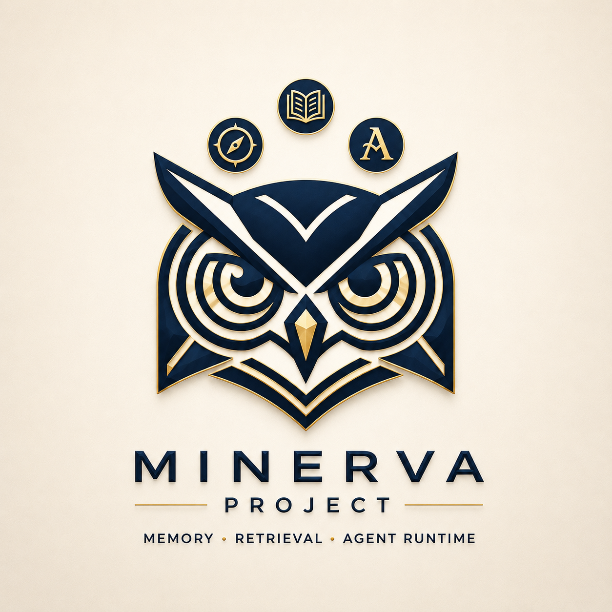
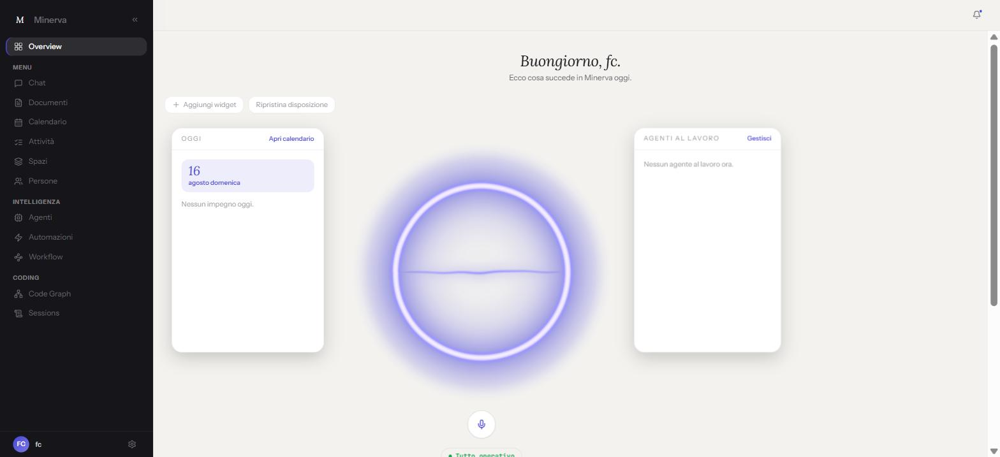
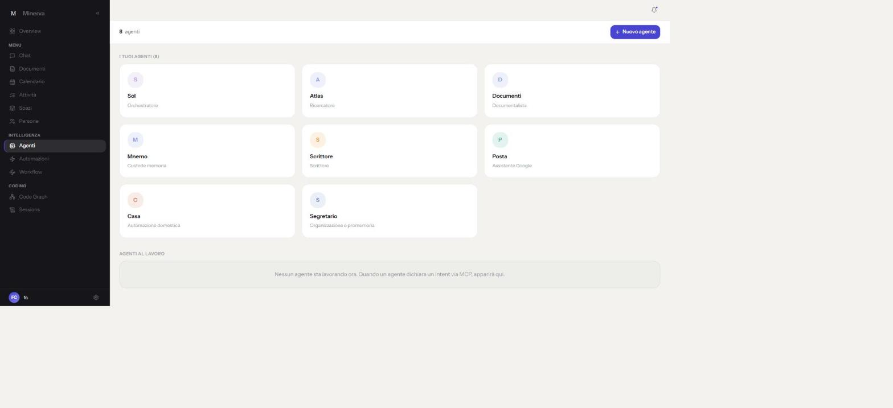
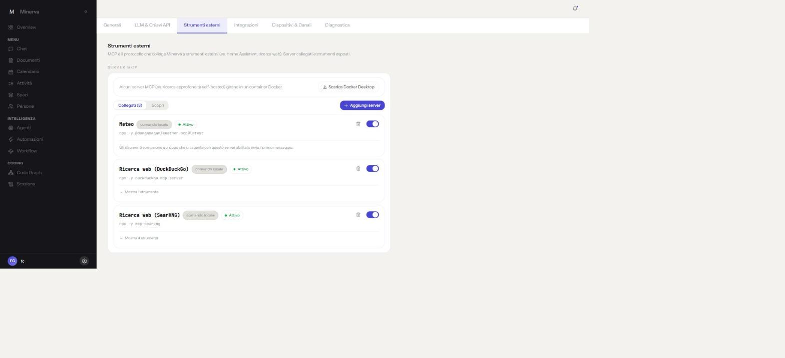
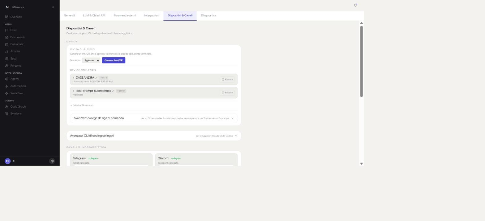

# Minerva

<p align="center">
  
</p>

<p align="center">
  
  
  
  
  
</p>

<p align="center">
  <a href="#install">Install</a> ·
  <a href="#connect-a-client">Connect</a> ·
  <a href="#upgrade">Upgrade</a> ·
  <a href="#screenshots">Screenshots</a> ·
  <a href="#learn-more">Docs</a>
</p>

---

**Minerva is a local-first AI system that remembers you, connects to your
tools, and gets things done through specialized agents.**

Talk to it by voice, text, Telegram, or Discord. Connect Gmail, Calendar,
Drive, Home Assistant, and anything that speaks MCP. Hand off research,
writing, or scheduling to one of its agents.

Ask what's on your calendar. It checks, pulls the right context from memory,
and drafts a briefing. Ask it to dig into something. An agent picks it up and
works in the background while you do something else. Come back next week —
it still knows what you told it.

Minerva itself doesn't require a cloud account. Your data, memory, and
orchestration live on your machine. Use a local model or bring your own
cloud API key.

[**Install Alpha**](#install) · [**See how it works ↓**](#screenshots)

---

## Screenshots

**Overview** — a voice-first home screen: today's calendar, agents currently
at work, and a mic to just talk to Minerva.



**Agents** — the roster of specialized agents Minerva can delegate to, each
with its own role.



**Integrations** — MCP servers and external tools connected to Minerva, with
per-server tool visibility.



**Devices & Channels** — pair a new device with a QR code (no terminal
required), and connect Telegram or Discord to talk to Minerva from there.



More in the [dashboard tour](docs/dashboard.md).

---

## Why Minerva is different

**Agents that work in the background.** A roster of specialized agents —
research, writing, scheduling, home automation — Minerva can talk to directly
or delegate to on your behalf.

**Connected to your world.** Gmail, Calendar, Drive, Home Assistant, Telegram,
Discord, and any MCP server you add. Minerva reads across them instead of
treating each one as its own silo.

**One memory, every surface.** Chat with Minerva directly, or connect Claude
Code, Cursor, and Codex over MCP — they read and write the same memory.
Personal assistant and coding-agent memory are two separate products
everywhere else. Here, they're one.

**On your machine, not someone else's.** The database, the memory, the agents,
all of it lives on your machine. Back it up by copying a folder. Nothing to
export, nothing running on a server you don't control.

---

## Status

**Current release: 0.1.3-alpha — early testing.**

We're currently looking for a small group of early testers. If you want to
try Minerva, break things, and tell us what sucks, [start a
discussion](../../discussions) or [open an issue](../../issues).

What is working today:

- Minerva dashboard — chat with Minerva, manage agents, integrations, devices,
  and channels, inspect memory, all in a local browser UI
- Assistant chat — text and voice, plus Telegram and Discord as messaging
  channels (WhatsApp and email are on the roadmap)
- Agents — a roster of specialized agents (research, writing, home automation,
  scheduling, memory) that can be delegated to from chat
- Integrations — Google (Gmail, Calendar, Drive, Tasks, YouTube), Home
  Assistant, and any MCP server you add
- MCP server — running and accepting connections from supported coding clients
- CLI (`foundation` binary) — installs and runs on Linux, macOS, and Windows
- Remote access — reachable from another machine over a private network or VPN

The core is functional. Packaging and naming are still being cleaned up.
[Open an issue](../../issues) if something breaks.

---

## Supported clients

Works with Claude Code, Cursor, Codex, OpenClaw, and any other
MCP-compatible client. Claude Code and OpenClaw also get automatic,
hands-off memory through native lifecycle hooks.

[See all supported clients →](docs/clients.md)

---

## Naming: Minerva and Foundation

The public project name is Minerva.

The current CLI command is `foundation`. This is a temporary gap while naming
and packaging are being cleaned up. When you install and run the system, you
will be calling `foundation` at the terminal. That is the right binary.

Expect `foundation` in all commands for now.

---

## Requirements

Supported platforms:

- Linux x86_64
- macOS Apple Silicon
- Windows x86_64

Linux aarch64 and broader coverage are planned in later releases.

The binary bundle is self-contained — no Docker, no separate runtime to
install. Chat and agents need an LLM: point Minerva at a local model (e.g.
Ollama) or a cloud provider's API key, your choice.

---

## Install

Pick your system, open the app it names, paste the one line, press Enter.

### macOS (Apple Silicon)

Open **Terminal** — press `Cmd + Space`, type `Terminal`, press Enter — then
paste this and press Enter:

```bash
curl -fsSL https://raw.githubusercontent.com/XdotX78/Minerva-Project/main/install.sh | bash
```

Intel Macs aren't supported yet; check the releases page for updates.

### Linux (x86_64)

Open your terminal, paste this, press Enter:

```bash
curl -fsSL https://raw.githubusercontent.com/XdotX78/Minerva-Project/main/install.sh | bash
```

### Windows

Open **PowerShell** — right-click the Start button, choose "Windows
PowerShell" or "Terminal" — then paste this and press Enter:

```powershell
irm https://raw.githubusercontent.com/XdotX78/Minerva-Project/main/install.ps1 | iex
```

### What happens next

Same on all three: the installer downloads Minerva, checks it, and finishes
by starting it and opening the dashboard in your browser on its own. No
second command to run, no address to go find, no app icon to hunt for.

Manual install:

1. Download the right archive from the latest release.
2. Extract it.
3. Move the `foundation` binary and bundled sidecars somewhere stable.
4. Follow the release notes for client setup.

The rollout is staged. Check the release notes to confirm which platform assets
are published before relying on the installer.

---

## Verify downloads

Each public release includes:

- platform archives
- `SHA256SUMS`
- short release notes

```bash
sha256sum -c SHA256SUMS
```

---

## Connect a client

The quickest path is the built-in connector:

```bash
foundation connect <tool>
```

```bash
foundation connect cursor
foundation doctor cursor
```

Full connector ID list and per-client notes: [docs/clients.md](docs/clients.md).

---

## Upgrade

If you already have Minerva installed, use the built-in update command:

```bash
foundation update
foundation restart
```

This downloads the latest release, replaces the binary, and leaves your database
and configuration untouched.

To pin a specific version:

```bash
foundation update --version 0.1.3-alpha
```

To roll back, download a previous release archive and extract it in place.

For a fresh machine or a broken install, re-run the full installer:

```bash
curl -fsSL https://raw.githubusercontent.com/XdotX78/Minerva-Project/main/install.sh | bash
```

---

## Uninstall

Remove the `foundation` binary and bundled sidecar components. The data
directory is separate — removing it is optional and will delete your stored
memory.

Check the release notes for the exact paths for your platform.

---

## Backup

Your memory database is a regular file on disk. Back it up by copying the data
directory. No special export step is needed.

The database survives upgrades. Your memory is not reset when you update the binary.

---

## Learn more

The sections above are everything you need to try Minerva. For how it works
under the hood:

- [Memory](docs/memory.md) — structured vs. document memory, agents, tasks, session review
- [Dashboard](docs/dashboard.md) — full tour of what the local UI shows and does
- [Architecture](docs/architecture.md) — why it's fast, local-first networking
- [Claude Code integration](docs/claude-code.md) — automatic memory via lifecycle hooks
- [OpenClaw integration](docs/openclaw.md) — automatic memory via lifecycle hooks
- [Supported clients](docs/clients.md) — full connector list and setup

---

## What you get here

This is the public distribution repository for Minerva.

It contains public releases, install instructions, checksums, compatibility
notes, and issue tracking for install and release problems. It does not contain
the application source code.

---

## Support

Use this repository for:

- install failures
- broken release assets
- compatibility reports
- documentation fixes

---

## License

Minerva binaries and documentation are distributed under the terms published in
the release and repository metadata. The source code remains private.
