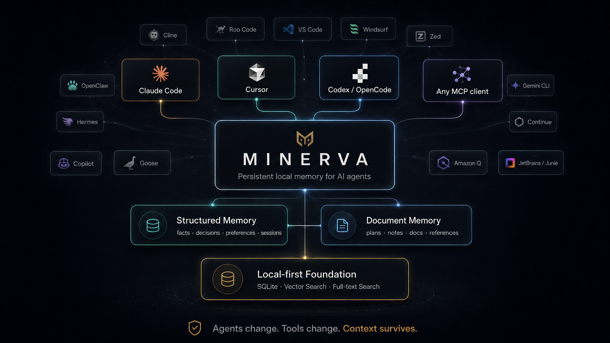

# Minerva

<p align="center">
  
</p>

<p align="center">
  
  
  
  
  
</p>

<p align="center">
  <a href="#install">Install</a> ·
  <a href="#connect-a-client">Connect</a> ·
  <a href="#minerva-dashboard">Dashboard</a> ·
  <a href="#upgrade">Upgrade</a> ·
  <a href="#screenshots">Screenshots</a>
</p>

---

Every AI session starts cold. Switch tools, open a new window, and the
context is gone. You explain yourself again.

Minerva is a local AI assistant you actually talk to — chat, voice, Telegram,
Discord — built on one memory that never resets. Ask what's on your calendar,
have it draft an email, hand something off to one of its agents. Bring up a
decision from three weeks ago mid-sentence and it already knows what you
mean, because it was there.

Here's the part almost nobody else does: connect your coding tools to that
same memory over MCP, and Claude Code, Cursor, and Codex pick up exactly
where a conversation with Minerva left off — and where each other left off,
too. Personal assistants and coding-agent memory are two separate products
everywhere else. Minerva is one memory, both worlds.

It all runs on your own machine. No cloud account behind it to get acquired,
shut down, or quietly change its terms, because there isn't one.

```
you talk to Minerva (chat, voice, Telegram, Discord) → Minerva remembers
coding agents connect over MCP → they read and write the same memory
```

<p align="center">
  
</p>

---

## Status

**Current release: 0.1.2-alpha — public alpha.**

What is working today:

- Minerva dashboard — chat with Minerva, manage agents, integrations, devices,
  and channels, inspect memory, all in a local browser UI
- Assistant chat — text and voice, plus Telegram and Discord as messaging
  channels (WhatsApp and email are on the roadmap)
- Agents — a roster of specialized agents (research, writing, home automation,
  scheduling, memory) that can be delegated to from chat
- Integrations — Google (Gmail, Calendar, Drive, Tasks, YouTube), Home
  Assistant, and any MCP server you add
- MCP server — running and accepting connections from supported coding clients
- CLI (`foundation` binary) — installs and runs on Linux, macOS, and Windows
- Remote access — reachable from another machine over a private network or VPN

The core is functional. Packaging and naming are still being cleaned up.

---

## Already running

- SQLite + vec0 on disk, no cloud, no subscription, no external dependency
- A local dashboard you actually use day to day, chat included
- MCP over stdio for coding tools — any MCP client connects in minutes
- Hybrid search: full-text (BM25) + semantic (vec0) in one query
- Decision lineage: what was decided, why, which session it came from
- Cross-domain discovery: connections between facts you never explicitly linked
- A roster of agents you can talk to or delegate work to
- Messaging channels: talk to Minerva from Telegram or Discord, not just the browser
- 19 connectors for coding tools: Claude Code, Claude Desktop, Cursor, Codex,
  OpenCode, OpenClaw, Cline, Roo Code, VS Code, Windsurf, Zed, Gemini CLI,
  Continue, Copilot, Hermes, Pi, Amazon Q, JetBrains (Junie), Goose
- Linux, macOS, Windows

---

## What Minerva is

A local-first personal AI assistant, built around a memory layer that never
resets.

You talk to it. It decides what's worth remembering, on its own — no folders
to file things into, no tags to maintain. The database, the dashboard, the
agents, all of it lives on your machine, not a vendor's cloud. That's not a
privacy footnote, it's the whole design: a company can raise a round, get
acquired, or shut down a product line. Your own hard drive doesn't do any
of that to you.

---

## Two memory layers

### Structured memory

The fast path.

Decisions, insights, preferences, project facts, relations between entities,
session continuity. This is what lets Minerva — or any agent connected to
it — resume work without rebuilding context from scratch.

### Document memory

The deeper path.

Long-form material — plans, notes, documentation, references — kept searchable
without flooding the active memory path. RAG-style fallback when the task needs
to go deeper.

Fast structured recall by default. Document retrieval only when the question
actually requires it.

---

## Beyond memory: agents, tasks, and coordination

Minerva also tracks:

- an agent roster: specialized agents you can talk to directly or that Minerva
  delegates to on your behalf
- intent registry: what an agent was trying to do, not just what it stored
- task coordination: structured task state that persists across sessions and clients
- workflow traces: a record of what happened, when, and in what sequence

Minerva can reconstruct the shape of previous work: what was in progress, what
was decided, what was abandoned and why — whether that work happened in a chat
with Minerva or in a coding session connected over MCP.

---

## Minerva dashboard

This is where you actually live day to day: talk to Minerva, see what it's
connected to, and check under the hood when you're curious.

What it shows today:

- **Chat** — talk to Minerva directly, by voice or text, with full history
- **Agents** — the roster of specialized agents, what each one does, and what
  they're working on right now
- **Integrations** — Google Workspace, Home Assistant, and MCP servers you've
  connected
- **Devices & Channels** — pair a phone or another device with a QR code, and
  connect Telegram or Discord as a way to reach Minerva
- **Calendar, Tasks, Documents, Automations** — the everyday surfaces of a
  personal assistant
- **Memory** — entities, facts, relations in structured memory, full-text and
  semantic search
- **Decisions** — open decisions with verify / dispute / close actions
- **Diagnostics** — system health, index consistency, memory counts

What you can do:

- talk to Minerva and delegate work to its agents
- connect integrations and messaging channels without touching a config file
- inspect and search stored memory directly
- review and close open decisions
- monitor system health and index status

---

## Screenshots

**Overview** — a voice-first home screen: today's calendar, agents currently
at work, and a mic to just talk to Minerva.


**Agents** — the roster of specialized agents Minerva can delegate to, each
with its own role.


**Integrations** — MCP servers and external tools connected to Minerva, with
per-server tool visibility.


**Devices & Channels** — pair a new device with a QR code (no terminal
required), and connect Telegram or Discord to talk to Minerva from there.


---

## Naming: Minerva and Foundation

The public project name is Minerva.

The current CLI command is `foundation`. This is a temporary gap while naming
and packaging are being cleaned up. When you install and run the system, you
will be calling `foundation` at the terminal. That is the right binary.

Expect `foundation` in all commands for now.

---

## Supported clients

Beyond its own chat, Minerva exposes a standard MCP server for coding tools.
Any client that speaks MCP can connect and share the same memory.

Clients with confirmed connectors:

| Client | Status |
|---|---|
| Claude Code | Supported (automatic memory) |
| Claude Desktop | Supported |
| Cursor | Supported |
| Codex | Supported |
| OpenCode | Supported |
| OpenClaw | Supported (automatic memory) |
| Cline | Supported |
| Roo Code | Supported |
| VS Code | Supported |
| Windsurf | Supported |
| Zed | Supported |
| Gemini CLI | Supported |
| Continue | Supported |
| Copilot | Supported |
| Hermes | Supported |
| Pi | Supported |
| Amazon Q | Supported |
| JetBrains (Junie) | Supported |
| Goose | Supported |

If your tool supports MCP server configuration, it should work.

## Automatic memory: Claude Code and OpenClaw

Most MCP clients load memory **on demand** — the agent calls a tool when it needs
context. Two clients go further and make the whole loop hands-off through native
lifecycle hooks: **Claude Code** and **OpenClaw**. With these, you never have to
remember to load or save anything.

### The loop

```
session starts  → memory snapshot injected automatically
you work        → facts and decisions captured as you go
session ends    → session summarized and saved automatically
```

### Claude Code

`foundation connect claude-code` plus the bundled hooks wire three events:

- **SessionStart** — injects a memory snapshot (active project, recent decisions,
  open threads) before your first message.
- **PostToolUse (Write / Edit)** — captures work in real time as files change.
- **Stop** — summarizes the session and extracts durable facts when the session ends.

### OpenClaw

[OpenClaw](https://github.com/openclaw/openclaw) exposes the same kind of lifecycle
events. `foundation connect openclaw`:

1. Registers the Minerva MCP server in `~/.openclaw/openclaw.json`.
2. Installs two hooks in `~/.openclaw/hooks/`:
   - **foundation-bootstrap** (`gateway:startup`, `agent:bootstrap`) — loads the
     snapshot and injects it into the agent at startup.
   - **foundation-session** (`gateway:shutdown`, `/new`, `/reset`) — saves the
     session back into memory in the background.

Enable the hooks once and restart the gateway:

```bash
foundation connect openclaw
openclaw hooks enable foundation-bootstrap foundation-session
```

Clients without lifecycle hooks (Codex, Cursor, and the rest) still read and write
memory through MCP — they just do it on demand instead of automatically.

## Session review

Capturing a raw session is cheap. Turning it into **durable memory** is the job of the
session-review pass.

A summary records what happened. Session review goes one level up: it reads the
session and extracts the signals worth keeping for next time —

- **decisions** — what was decided and why
- **insights** — non-obvious things learned
- **behavioral signals** — how you prefer to work (corrections, confirmed approaches)
- **open threads** — what is still unfinished

These are written into Minerva as first-class memory, sourced back to the session,
so the next agent on any client starts from conclusions instead of re-reading a
transcript.

**When it runs.** On Claude Code the Stop hook marks a review as pending when a
session is substantial enough to be worth it; the review then runs as a background
sub-agent. On clients without a stop hook (e.g. Codex), Minerva marks the same
pending state and the review runs when you trigger it. Either way the goal is the
same: nothing durable from a working session is lost when the session closes.

---

## Local-first, not only localhost

Your data lives on your machine, under your control. Minerva runs as a local
service — the dashboard, the assistant, and the MCP server are all one process
on your box, not a call to someone else's API.

Local-first does not mean locked to localhost, though. Minerva can be reached
from another machine on the same private network or over a VPN or Tailnet.
Useful when you want to talk to Minerva from your phone, or your editor needs
to reach the same memory server from a different machine.

Minerva does not expose a raw public endpoint. If you route it over a private
network or Tailscale, that is your call. The default is local.

---

## Why it is fast

Minerva is written in Rust and built around fast local retrieval. Memory only
matters if using it is cheap enough to become part of normal workflow. If recall
is slow or noisy, people stop using it.

The design is: local storage, compact structured memory, fast search paths for
active recall, and a document path for deeper fallback when needed.

Normal work hits structured memory first. Longer material comes in only when
the task actually needs it.

---

## Requirements

Supported platforms:

- Linux x86_64
- macOS Apple Silicon
- Windows x86_64

Linux aarch64 and broader coverage are planned in later releases.

The binary bundle is self-contained — no Docker, no separate runtime to
install. Chat and agents need an LLM: point Minerva at a local model (e.g.
Ollama) or a cloud provider's API key, your choice.

---

## Install

Linux and macOS:

```bash
curl -fsSL https://raw.githubusercontent.com/XdotX78/Minerva-Project/main/install.sh | bash
```

Windows PowerShell:

```powershell
irm https://raw.githubusercontent.com/XdotX78/Minerva-Project/main/install.ps1 | iex
```

That's it — the installer starts Minerva and opens the dashboard in your
browser automatically when it's done. No separate command to run, no address
to go find.

Manual install:

1. Download the right archive from the latest release.
2. Extract it.
3. Move the `foundation` binary and bundled sidecars somewhere stable.
4. Follow the release notes for client setup.

The rollout is staged. Check the release notes to confirm which platform assets
are published before relying on the installer.

---

## Verify downloads

Each public release includes:

- platform archives
- `SHA256SUMS`
- short release notes

```bash
sha256sum -c SHA256SUMS
```

---

## Connect a client

The quickest path is the built-in connector:

```bash
foundation connect <tool>
```

Supported connector IDs: `claude-code` · `claude-desktop` · `cursor` · `codex` ·
`opencode` · `openclaw` · `cline` · `roo-code` · `vscode` · `windsurf` · `zed` ·
`gemini-cli` · `continue` · `copilot` · `hermes` · `pi` · `amazon-q` ·
`jetbrains` · `goose`

Example:

```bash
foundation connect cursor
foundation doctor cursor
```

Check the release notes for the config format if you need to set up a client
manually.

---

## Usage examples

### Talking to Minerva directly

Open the dashboard, or message the bot on Telegram or Discord once it's
paired. Ask it to check your calendar, draft an email, or just talk through
what you're working on. It remembers the conversation the next time you open it.

### Memory across sessions with Claude Code

Start a coding session, work on a project. Minerva records decisions,
preferences, and facts as you go. Close Claude Code. Open it again tomorrow.

The model picks up context from where it left off: what you decided, what the
project state was, what changed. No manual context-pasting.

### Switching clients mid-project

You start in Claude Code, then move to Cursor for a different part of the work.
Both clients point at the same Minerva server. Cursor sees the same memory that
Claude Code built up. The project context is not locked to the client.

### Structured search and document retrieval

You ask the model to find a decision you made two weeks ago about an API design.
Minerva queries structured memory first. If the answer is not there, it falls
back to the document layer — searching long-form material, plans, and reference
docs you have stored.

The model gets a specific, sourced answer rather than reasoning from scratch.

---

## Upgrade

If you already have Minerva installed, use the built-in update command:

```bash
foundation update
foundation restart
```

This downloads the latest release, replaces the binary, and leaves your database
and configuration untouched.

To pin a specific version:

```bash
foundation update --version 0.1.2-alpha
```

To roll back, download a previous release archive and extract it in place.

For a fresh machine or a broken install, re-run the full installer:

```bash
curl -fsSL https://raw.githubusercontent.com/XdotX78/Minerva-Project/main/install.sh | bash
```

---

## Uninstall

Remove the `foundation` binary and bundled sidecar components. The data
directory is separate — removing it is optional and will delete your stored
memory.

Check the release notes for the exact paths for your platform.

---

## Backup

Your memory database is a regular file on disk. Back it up by copying the data
directory. No special export step is needed.

The database survives upgrades. Your memory is not reset when you update the binary.

---

## What you get here

This is the public distribution repository for Minerva.

It contains public releases, install instructions, checksums, compatibility
notes, and issue tracking for install and release problems. It does not contain
the application source code.

---

## Support

Use this repository for:

- install failures
- broken release assets
- compatibility reports
- documentation fixes

---

## License

Minerva binaries and documentation are distributed under the terms published in
the release and repository metadata. The source code remains private.
